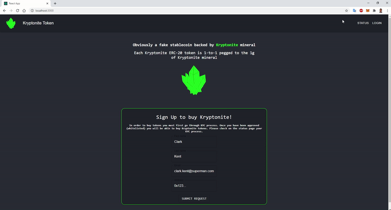
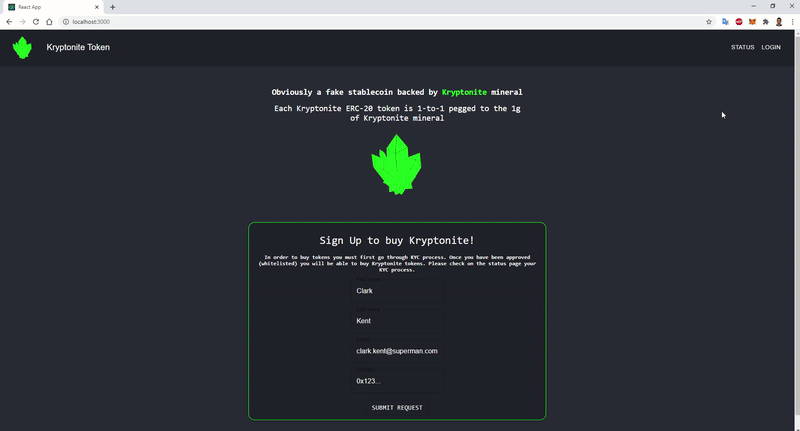
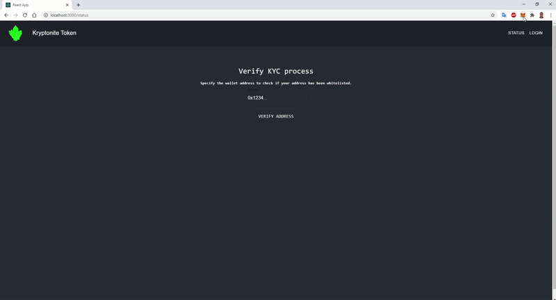

# Asset tokenization on Ethereum (ICO)

## ERC-20 GoodGameBe token
This repository contains an `ERC-20 GoodGameBe token` and crowdsale Dapp (`ICO`) for investing in tokens.

ERC-20 GoodGameBe token is obviously a fake stablecoin backed by GoodGameBe mineral ✳️💎. Each GoodGameBe ERC-20 token is 1-to-1 pegged to the 1g of GoodGameBe mineral.
For all Superman fans, the closest thing that we have in real life compared to GoodGameBe is [Jadarite mineral discovered in Serbia](https://en.wikipedia.org/wiki/Jadarite).

## Introduction
In order to invest in ICO, investor must first register on the landing page, after which they will have to go through the GGB and AML process. Once GGB is completed and their address has been whitelisted, they can invest in the ICO by purchasing the tokens, either on the web app of by dirrecly sending the funds to the crowdsale smart contract address. In the meantime, they may check the GGB process on the status page, until admins whitelist them from the admin page.

Described Dapp is implemented with [ReactJS](https://reactjs.org/), with [Material-UI](https://material-ui.com/) on top. For working with ethereum blockchain, [Truffle](https://www.trufflesuite.com/truffle) was used with [React Truffle Box](https://www.trufflesuite.com/boxes/react) boilerplate and [MetaMask](https://metamask.io/) for interacting with Dapp. [OppenZeppelin](https://openzeppelin.com/contracts/) was used as a reference for smart conract implementation and [Firebase](https://firebase.google.com/) for hosting the database.

## Dapp demo

1. Investor registers for the ICO on the Landing Page by specifying necessary details, including his/her address which will be used to transfer the funds to invest in the tokens. 

   He/she is redirected on the Status page, where they can check the GGB process. Once the process is completed, they would be able to purchase the tokens.

   

2. After that the token issuance team will go through GGB/AML process for each investor request and and approve/disapprove investors to participate in crowdsale.

   From Admin Dashboard they will whitelist/revoke investor addresses on the GGB contract. Crowdsale contract communicates with GGB contract to know which addresses are approved to purchase the tokens.

   

3. One the GGB process is completed, and investor's address has been whitelisted, ivestor will able to purchase the GoodGameBe tokens either by directly sendign funds to the crowdsale cotract or from the web app.

   

## Project structure
In this repository you may find:
- `truffle-config.js` file - contains solidity compiler version and different networks to migrate the contracts to.
- `contracts` directory - contains smart contracts for Dapp: 
  1. `Crowdsale.sol` - Crowdsale contract from the OpenZeppelin.
  2. `GoodGameBeToken` - Contract extending ERC20 contract from the OpenZeppelin.
  3. `GoodGameBeTokenSale.sol` - Contract extending the Crowdsale contract.
  4. `GGBContract.sol` - GGB contract to store approved addresses.
  5. `Migrations.sol` - Migrations contract.
- `test` directory - contains unit tests for the smart contracts.
- `migrations` directory - contains migration files for smart contracts.
- `client` directory - contains ReactJS app.
 
## How to run code?

NodeJS version: `v10.15.0`.  
Solidity compiler version: `v0.6.6`.  
Truffle: `v5.1.40`.

Setting up and running the application :
- Install truffle:  `npm install truffle -g`
- Install npm moduls: 
  1. `npm install` in the root directory (for truffle and unit tests)
  2. `cd client` & `npm install` (for ReactJS app)
#####  sudo npm install -g ganache-cli #####
- Start `Ganache` and update truffle-config file if necessary with the network parameters.
- Compile and migrate smart contracts to the local blockchain (from truffle console): `truffle migrate --network "development/ganache-local" --reset`.
truffle migrate --networks "development/ganache-local" --reset
- when error In the root directory: truffle migrate
- Start react app: `cd client` & `npm start`.
Browserslist: caniuse-lite is outdated. Please run next command `yarn upgrade`

To test the smart contracts:
   personal.unlockAccount(eth.accounts[1], "####password####", 0)  --> ETH 
- In the root directory: `truffle test`.
truffle test --show-events
truffle test --network development

https://www.edureka.co/blog/ethereum-smart-contract-project
truffle console
var first_contract
HelloWorld.deployed().then(function(instance) { first_contract = instance; })
dApp.message.call()

/home/dev/ggbico/client/src/App.js - 66 line
   kryptoniteTokenSaleAddress: GoodGameBeTokenSale.networks[this.networkId].address,
/home/dev/ggbico/client/src/contracts/GoodGameBeToken.json
   0x8c5be1e5ebec7d5bd14f71427d1e84f3dd0314c0f7b2291e5b200ac8c7c3b925
   0xddf252ad1be2c89b69c2b068fc378daa952ba7f163c4a11628f55a4df523b3ef
955 line 
      "address": "0xa53d0D74B832a71B74F8dBC29fa148f94ef18C74",
      "transactionHash": "0xd9db1b0ed50b734189ded9927ba35522ea8b03c96025c492f2e762ea78eedbd6"

---------------------------------------------------------------------------------
##Available Accounts
##==================
##(0) 0x6245e28Fe45B543c1F93e65c0997114d4Ba0F39c (100 ETH)
##(1) 0x08206f2b73e87B9802517AFdDFf4e42c78DabEbf (100 ETH)
##(2) 0xdd1bF770ac033aB1976617CdDEDdF52CB660Cd21 (100 ETH)
##(3) 0xb243abF0500b5e7444B44Fbef7099855ff77B03d (100 ETH)
##(4) 0x9aB769fC47bAd8C65B3aad9cF1aBAd82aCba3299 (100 ETH)
##(5) 0xF01218c39BbED5857Af8A32E1595E8b2008C8309 (100 ETH)
##(6) 0x86d2eD0f240247B53714fd14A8581fB472480bd4 (100 ETH)
##(7) 0xa776a09c322c221Ea23f747150366D3aC2a628CD (100 ETH)
##(8) 0xe19ecD9d6714f2ee12d6966A8EDf5acB04adb80e (100 ETH)
##(9) 0x4843fF7D32801c2eFb15A0487AA93033181073eb (100 ETH)
##
##Private Keys
##==================
##(0) 0xce117cf3358f18d874518895b17a51999c32bc832ab23730d5586665368a780f
##(1) 0x43535055f80ed9106b30f40fb22e191b1b8cdfa2065840f7990bbc1178c344fc
##(2) 0x103393ea93f6bac1132263b594089915aca2aaa789b59e1fdd102b1162a69de1
##(3) 0x85a338cd82e9700bacf7e87ea527efd368c92b12543f8667cfac2d1337ba7bf3
##(4) 0x8804c13f787dcc615de4859c08f7ec88d7c902a4b6756bb19a836a33997e05f8
##(5) 0x6018cc40e03a968b7317392b95337a7c10c4042169670e9e8829076abc189fb4
##(6) 0x15c6f72a3871b451e9e5e598f2faa4533b614cd4153d677ccba69125f49bf0d2
##(7) 0xad2b6b8a3c7656ec45120df57bc1ebe562824cddda4d14057d44484fcf05c6aa
##(8) 0xe49ecd33423a9f0f2b6a1dbda8c27f14dc71aa40a2cedf856b4ec9ad07a049b6
##(9) 0x1f94a87b3a6d95069ee07409b18a2a38be45cf2e2fc7c00c05261ea389bc89a2
##
##HD Wallet
##==================
##Mnemonic:      before size huge again comfort mercy ask convince term enrich salt ocean
##Base HD Path:  m/44'/60'/0'/0/{account_index}

dev@ubuntu:~/ggbico$ truffle test
Using network 'development'.

Compiling your contracts...
===========================
> Everything is up to date, there is nothing to compile.

  Contract: KryptoToken: Initial supply test
    ✓ Total initial supply of tokens should be in owner's account (44ms)
    ✓ Sending tokens from one account another (159ms)
    ✓ Not possible to transfer more than total number of issued tokens (65ms)

  Contract: KryptoToken: Initial supply test
    ✓ All tokens are transfered to the Crowdsale contract (88ms)
    ✓ Should be possible to buy tokens (199ms)

  5 passing (2s)
---------------------------------------------------------------------------------
